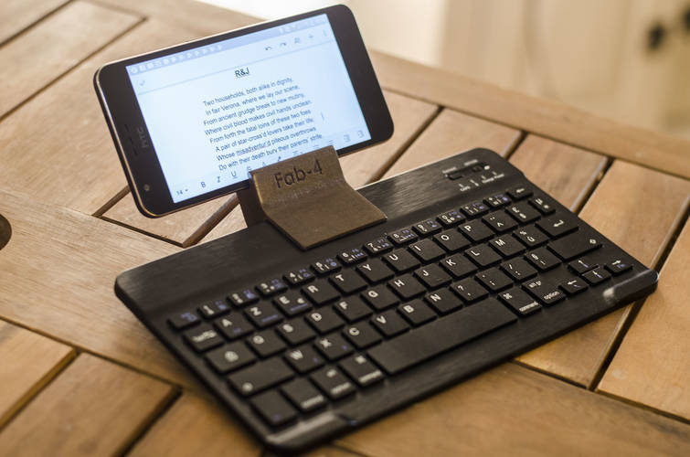

# Phone holder for Lenovo Trackpoint keyboard

This is the printable design for a **phone holder for the Lenovo Trackpoint keyboard**.

Please note that this holder is for the non-bluetooth variant of the Trackpoint keyboard, a.k.a. *Lenovo Trackpoint 1*.

## Concept

The general idea of how the phone will be attached is like this:

## Editing workflow

1. Edit SVG file, e.g. with [Inkscape](https://inkscape.org/).
2. Convert SVG file to STL, by running `svg_to_stl.scad` in [OpenSCAD](https://openscad.org/).
3. Print STL file.
